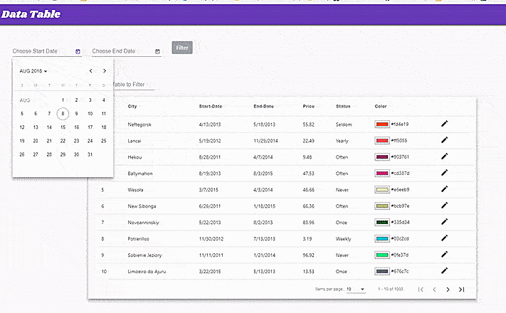

# SMS-FE

This Project is based majorly on Angular Material to display data from a JSON API.
This project was generated with [Angular CLI](https://github.com/angular/angular-cli) version 6.0.8.
## How it works
###  Home page:
- Displays data fetched in a table with sortable header
- User can select date range from datepicker to filter data
## Demo


## Build Setup
####  -Clone 
```
 git clone https://github.com/OlaJohn-Ajiboye/SMS-FE.git (or download Zip && Exract)
```
####  -cd (change directory) into sms-fe
```
 cd sms-fe
```
####  - install dependecies
```
 npm install
```
## Development server

-Run ```ng serve ``` for a dev server. Navigate to `http://localhost:4200/`. 
-The app will automatically reload if you change any of the source files. 
-Port 4200 is the deafult port for Angular. If port 4200 is in use on your machine.
-You can select another port by adding the --port flag eg:

#### - Changing default port
```
ng serve --port [portNumber]
 ```
 for example if you wish to use port 5000 run ``` ng serve --port 5000``` , then navigate to `http://localhost:5000/`

## Project Structure
- The `src` directory contains files and folder for development. The `app` folder contains required components, services and modules for the app.
- The `cities-table-component` is used to display the data in a tabular format using `Angular Material DataTable`

    .
    ├── e2e                     # End to End tests 
    ├── node_modules            # containe all depencies (after running ```npm install```)
    ├── src                     # Source folder (contains the app directory)
         ├── app                # Source files (brain of the app contains all `components`, `directives` and `services`)
    ├── test                    # Automated tests (alternatively `spec` or `tests`)
    ├── angular.json            # Angular configurations for App
    ├── package.json            # Here lives information about all depencies
    └── README.md
============================

## Code scaffolding

Run ``` ng generate``` component component-name` to generate a new component. You can also use `ng generate directive|pipe|service|class|guard|interface|enum|module`.

## Build

Run ```ng build``` to build the project. The build artifacts will be stored in the `dist/` directory. Use the `--prod` flag for a production build.

## Running unit tests

Run ```ng test``` to execute the unit tests via [Karma](https://karma-runner.github.io).

## Running end-to-end tests

Run ```ng e2e``` to execute the end-to-end tests via [Protractor](http://www.protractortest.org/).

## Further help

To get more help on the Angular CLI use `ng help` or go check out the [Angular CLI README](https://github.com/angular/angular-cli/blob/master/README.md).


